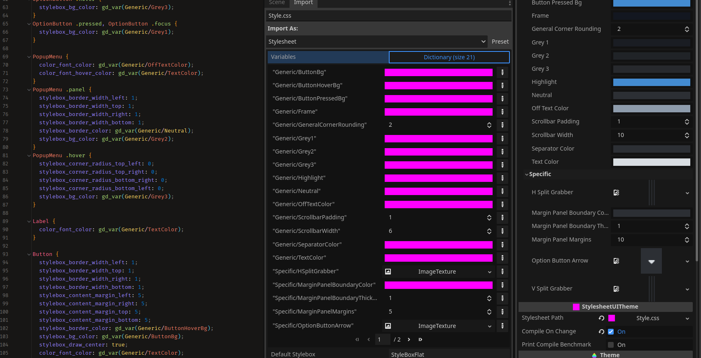
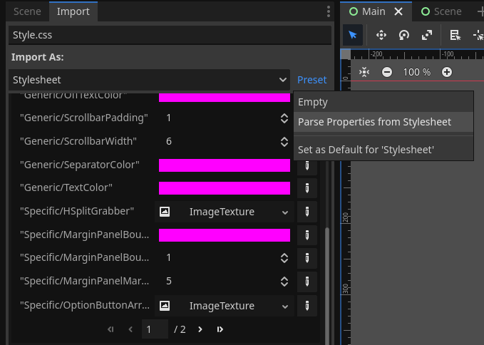
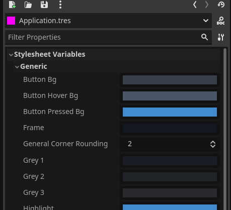

Stylesheet UI
_____________
Stylesheet UI is a C# plugin for Godot Editor that enables the use of CSS to create Godot Themes. SUI can replace Theming, but is primarily designed to be an assistant to the construction of Themes.

Note: SUI doesn't require your exports to be Mono/C# enabled. It is a current requirement that you at least run a Mono/C# enabled Editor.




# CSS/SCSS Example
<table>
    <tr>
        <th>SCSS (Using a SASS compiler to CSS for SUI ingestion)</th>
        <th>CSS</th>
    </tr>
<tr><td>

```scss
$Grey1: #{'gd_var(Generic/Grey1)'}; /*! $Generic/Grey1:Color:FF00FFFF */
$Grey2: #{'gd_var(Generic/Grey2)'}; /*! $Generic/Grey2:Color:FF00FFFF */
$Grey3: #{'gd_var(Generic/Grey3)'}; /*! $Generic/Grey3:Color:FF00FFFF */
$Neutral: #{'gd_var(Generic/Neutral)'}; /*! $Generic/Neutral:Color:FF00FFFF */

$OptionButtonArrow: #{'gd_var(Specific/OptionButtonArrow)'}; /*! $Specific/OptionButtonArrow:Texture: */

OptionButton {
    @include stylebox_content_margins(5);
    stylebox_content_margin_top: -1;
    stylebox_content_margin_bottom: -1;
    stylebox_border_color: $Neutral;
    @include stylebox_border_width(1);

    icon_arrow: $OptionButtonArrow;

    .normal {
        stylebox_bg_color: $Grey2;
    }

    .hover {
        stylebox_bg_color: $Grey3;
    }

    .pressed, .focus {
        stylebox_bg_color: $Grey1;
    }
}
```

</td><td>

```css
/*! $Generic/Grey1:Color:FF00FFFF */
/*! $Generic/Grey2:Color:FF00FFFF */
/*! $Generic/Grey3:Color:FF00FFFF */
/*! $Generic/Neutral:Color:FF00FFFF */
/*! $Specific/OptionButtonArrow:Texture: */
OptionButton {
    stylebox_content_margin_left: 5;
    stylebox_content_margin_right: 5;
    stylebox_content_margin_top: 5;
    stylebox_content_margin_bottom: 5;
    stylebox_content_margin_top: -1;
    stylebox_content_margin_bottom: -1;
    stylebox_border_color: gd_var(Generic/Neutral);
    stylebox_border_width_left: 1;
    stylebox_border_width_top: 1;
    stylebox_border_width_right: 1;
    stylebox_border_width_bottom: 1;
    icon_arrow: gd_var(Specific/OptionButtonArrow);
}
OptionButton .normal {
    stylebox_bg_color: gd_var(Generic/Grey2);
}
OptionButton .hover {
    stylebox_bg_color: gd_var(Generic/Grey3);
}
OptionButton .pressed, OptionButton .focus {
    stylebox_bg_color: gd_var(Generic/Grey1);
}
```

</td></tr>
</table>

# Limitations
The CSS language is only used for markup and merely provides a medium in which to write theming rulesets. The parsed/compiled result does not apply to controls/UI as it traditionally would do in Web Development. All the CSS does is provide a programmable pipeline for adjusting which parts of a Godot Theme is changed when an input variable has been changed.

As such, all the limitations that are imposed by Godot Themes are fully present within SUI. Don't think that SUI will solve these.

Right now, since the C# `ExCSS` package is being used, SUI does not support non-Mono enabled builds. This will change once a custom Stylesheet parser has been implemented.

# Requirements
- Mono enabled Godot (only required for Editor).
- NuGet `ExCSS` package installed for solution.
- Optional: Any Less/SASS/favorite CSS extension language compiler.

# Language
## Feature Transference
While the CSS language is used, it is only used for structural purposes. Only a small set of the CSS language is actually utilized, making SUI stylesheets simple to write. Here's a list of traditional CSS features/uses that "translate" differently to SUI.

| CSS                                                     | SUI                       |
|---------------------------------------------------------|---------------------------|
| Type Selector (`Button`)                                | Theme Node Type Selection |
| Class Selector (`.foo`)                                 | StyleBox Selection        |
| ID Selector (`#bar`)                                    | Not Supported             |
| Special Selectors (`:before`, `[attr]`, `*`, etc)       | Not Supported             |
| Inheritance Selectors (`p > a`)                         | Not Supported             |
| Standard Web Style Rules (`border-color`, `width`, etc) | Not Supported             |
| Custom Style Rules                                      | [See Below](#Style-Rules) |

## Style Rules
Style rules in SUI are relatively straight forward: all style rules must begin with the data type they are meant to adjust. The following are valid data types seen by SUI: `color_*`, `constant_*`, `font_*`, `fontsize_*`, `icon_*`, `stylebox_*`. Where `*` would be replaced with the applicable variable name.

## Inheritance
The `inherits` keyword placed within the beginning of the Theme Node Type Selector will set the `Base Type` of a Theme Type:

```css
VBoxContainerNoSeparation {
    inherits: VBoxContainer;
    constant_separation: 0;
}
```

## Styleboxes
Styleboxes can be all set at once or set individually.

### Select All
```css
Button {
    stylebox_bg_color: #FF00FFFF;
}
```

### Individual Selection
```css
HScrollBar .grabber, HScrollBar .grabber_highlight, HScrollBar .grabber_pressed {
    stylebox_border_color: #00FF00FF;
}
```
## Additions

### Properties & Variables
#### Declaring Properties
Properties and variables are what SUI is mostly all about. They can be defined within your Stylesheet with the following syntax: `/*! $MyVariableName:Type:Default */`. Once they have been defined, they can be used with the `gd_var(MyVariableName)` style function within the body of your Stylesheet.

An example can be seen below:

```css
... 
/*! $Generic/OffTextColor:Color:FF00FFFF */
/*! $Generic/ScrollbarWidth:Int:6 */
/*! $Generic/ScrollbarPadding:Int:1 */
/*! $Generic/SeparatorColor:Color:FF00FFFF */
/*! $Generic/TextColor:Color:FF00FFFF */
/*! $Specific/HSplitGrabber:Texture: */
...
```

#### Using Properties as Variables
Once a property has been defined, it can then be used within the Stylesheet.

```css
Button {
    color_font_color: gd_var(Generic/TextColor);
}
```

#### Importing Properties

From the _Preset_ dropdown, choose the _Parse Properties from Stylesheet_ option to automatically fill out the Stylesheet's properties.



#### Editing Property Values
During Editor runtime, these properties values can be adjusted in real-time.



### Functions
Currently only a single function exists.

| Function                 | Description                                                       |
|--------------------------|-------------------------------------------------------------------|
| `gd_var(MyVariableName)` | Allows variables to be substituted as a value for this style rule |

# Guide
1) Close your Editor. 
2) Open your solution file and add the latest version of `ExCSS` to your package list (NuGet is recommended).
3) Clone Stylesheet UI to your addons folder so that the folder structure resembles `/addons/StylesheetUI/plugin.cfg`.
4) Open your Editor and enable the Stylesheet UI plugin.
5) Create a new CSS file called "MyStyle.css" anywhere within your project folder structures and paste the following CSS into it.
```css
/*! $Generic/MyCoolColor:Color:FF00FFFF */
Label, TextEdit, LineEdit, OptionButton, PopupMenu {
    color_font_color: gd_var(Generic/MyCoolColor);
}
```
5) Inside the Import dialog box for the new Stylesheet, press the "_Parse_" button and select "Parse Properties from Stylesheet". This will populate the Stylesheet Variables dictionary.
   - _Note: This is a one time deal, although each time you add/remove/rename a property, this process of adding the property to the dictionary needs to be done again and the Stylesheet needs to be reimported_
6) Create a new StylesheetUITheme and then attach the new Stylesheet to the `Stylesheet` property of your new Theme.